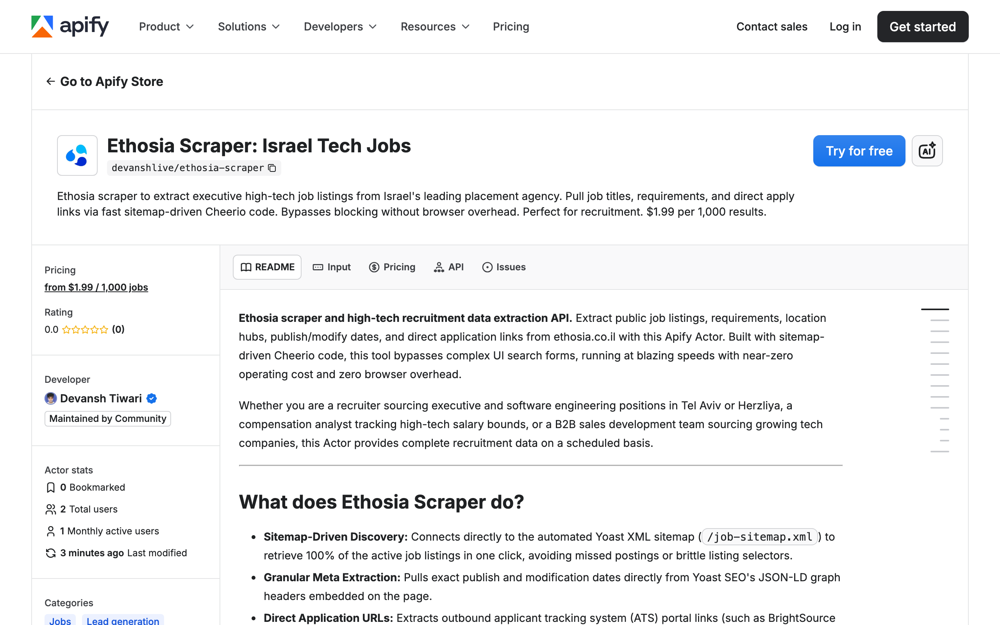

<div align="center">

# Ethosia Scraper | Israel Executive Tech Jobs | Apify Actor

[](https://apify.com/getascraper/ethosia-scraper) [](https://nodejs.org/) [](https://www.typescriptlang.org/) [](https://apify.com/getascraper/ethosia-scraper) [](https://ethosia.co.il/job-sitemap.xml)

**Ethosia scraper and Israeli executive tech recruitment data extraction API.** Pull job titles, requirements, location hubs, publish and modify dates, and direct ATS apply links from ethosia.co.il with this Apify Actor. Sitemap-driven Cheerio code, no browser overhead. Free tier included.

Whether you are a recruiter sourcing executive and software engineering positions, a compensation analyst tracking high-tech salary bounds, or a B2B sales development team hunting for growing tech companies, this Actor delivers clean, structured datasets.

[Quick Start](#quick-start) · [Output Schema](#output-schema) · [Pricing](#pricing) · [FAQ](#faq)

</div>



---

## What is Ethosia Scraper?

**Ethosia scraper and Israeli high-tech recruitment data extraction API.** This Apify Actor turns [ethosia.co.il](https://ethosia.co.il) (Israel's premier executive and high-tech recruitment agency) into clean structured JSON with title, requirements, location, ATS apply links, and exact publish / modify dates pulled from the Yoast SEO JSON-LD graph.

Built for executive search firms, AI/RAG developers, recruitment agencies, and B2B sales teams that need Israeli high-tech and leadership hiring data without copy-pasting from job boards.

## Why use Ethosia Scraper?

- **Sitemap-driven discovery** - Connects directly to the Yoast XML sitemap (`/job-sitemap.xml`) to retrieve 100% of the active job listings in one click. No missed postings, no brittle listing selectors.
- **Granular meta extraction** - Exact publish and modification dates pulled from Yoast SEO's JSON-LD graph headers. Track vacancy durations and hiring velocity.
- **Direct ATS apply URLs** - Outbound applicant tracking system links (BrightSource talents) with the exact vacancy identifier pre-populated.
- **No Cloudflare battle** - While Cloudflare is in active mode on `ethosia.co.il`, there is no active bot challenge, captcha, or cookie lock on job pages or sitemaps. Direct HTTP 200 access.
- **No proxy required** - The site allows direct, anonymous access. `useApifyProxy: false` is the default.
- **Lower price** - $1.99 per 1,000 jobs. 33% below the typical $3.00/1k competitors.

## Quick Start

```bash
npm install apify-client
```

```javascript
import { ApifyClient } from 'apify-client';

const client = new ApifyClient({ token: process.env.APIFY_TOKEN });

const run = await client.actor('getascraper/ethosia-scraper').call({
  searchQuery: 'Developer',
  location: 'Tel Aviv',
  maxItems: 100,
});

const { items } = await client.dataset(run.defaultDatasetId).listItems();
console.log(items);
```

## How to use

1. Open the Actor in [Apify Console](https://apify.com/getascraper/ethosia-scraper)
2. Leave **Ethosia URLs** empty to crawl all active listings via the Yoast XML sitemap (default)
3. Optionally set **Search Query** for a keyword like `Developer` or `VLSI`
4. Optionally set **Location** to a city like `Tel Aviv` or `תל אביב`
5. Set **Maximum items** (default 100, max 5,000)
6. Click **Start** and download the dataset as JSON, CSV, or Excel

You do not need Ethosia cookies, an Ethosia account, or a separate Ethosia API key. Israeli proxy is optional since there is no geographic firewall.

## What data does it extract?

| Field | Description |
|---|---|
| `type` | Always `job` |
| `jobId` | Unique numeric ID parsed from the direct application link or slug |
| `url` | Direct URL of the Ethosia vacancy card |
| `title` | Job title |
| `companyName` | Generic placement agency label (e.g. `High-Tech Startup / Enterprise`) |
| `location` | Primary location or tech hub parsed from description text |
| `description` | Core job description and company overview |
| `requirements` | Specific professional experience and tech requirements |
| `applyUrl` | Direct outbound ATS apply link |
| `postedDate` | ISO 8601 published date |
| `modifiedDate` | ISO 8601 modified date |
| `scrapedAt` | ISO 8601 scraping timestamp |

## Output Example

```json
{
  "type": "job",
  "jobId": "352837",
  "url": "https://ethosia.co.il/content/senior-vlsi-design-engineer/",
  "title": "Senior VLSI Design Engineer",
  "companyName": "High-Tech Startup / Enterprise",
  "location": "Tel Aviv",
  "description": "For an exciting well-funded start-up we are looking for highly skilled...",
  "requirements": "8+ years of experience in VLSI/ASIC design...",
  "applyUrl": "https://talents.brightsource.com/apply/?job_id=352837&job_name=Senior%20VLSI%20Design%20Engineer",
  "postedDate": "2026-03-02T09:15:45+00:00",
  "modifiedDate": "2026-03-02T09:15:57+00:00",
  "scrapedAt": "2026-06-06T10:00:00.000Z"
}
```

## Pricing

**$1.99 per 1,000 results.** Free tier included.

High-tech startup and executive vacancy data at 33% less than the typical $3.00/1k competitors. Near-zero compute bills since the scraper runs on static HTTP requests.

| Items scraped | Cost (USD) |
|---|---|
| 100 | $0.20 |
| 500 | $0.99 |
| 1,000 | $1.99 |
| 5,000 | $9.95 |
| 10,000 | $19.90 |

## Advanced Options

- **Yoast XML Sitemap Discovery** - Leave `startUrls` empty to crawl the entire active directory. The scraper fetches all live vacancies from the sitemap automatically.
- **Modest Concurrency** - Default `maxConcurrency: 10` keeps requests respectful of the WordPress backend.

## Supported URL types

- `https://ethosia.co.il/content/senior-vlsi-design-engineer/` (direct vacancy)
- `https://ethosia.co.il/job-sitemap.xml` (full sitemap, used automatically)
- `https://ethosia.co.il/` (homepage with category links)

## Use cases

- Source elite candidates for executive roles (Mamram / 8200 veterans, CTO, VP Engineering) exclusive to Ethosia's agency board
- Track talent demands across Israeli software engineering, AI, cyber security, and MLOps sectors
- Analyze vacancy durations and hiring velocity using publish and modify timestamps
- Generate B2B leads for tech companies with active high-tech expansion budgets

## FAQ

### How does this scraper get past Cloudflare?

It does not have to. While Cloudflare is in active mode on `ethosia.co.il`, there is no active bot challenge, captcha, or cookie lock configured for the job pages or sitemaps. Unauthenticated requests are welcomed with `200 OK`.

### Do I need a login or API Key?

No. All Ethosia vacancy listings are fully public and require no authentication or cookies to read.

### Why is the company name generic?

Ethosia is a placement agency and hides the actual brand names of hiring companies in their public descriptions. They use generic labels like `High-Tech Startup` or `Enterprise` to protect clients from competitors.

## Disclaimers

This Actor is an independent web scraping tool and is not affiliated with, endorsed by, or sponsored by Ethosia, Ethosia Digital, ethosia.co.il, or any of their subsidiaries or affiliates. All trademarks are the property of their respective owners.

The scraper accesses only the public, unauthenticated job listings of the Ethosia website, matching data the platform serves to any public user. Users are responsible for ensuring compliance with Ethosia Terms of Service and local data regulations (GDPR).

## Support

- GitHub Issues: https://github.com/getascraper/how-to-scrape-ethosia/issues
- Apify Console: https://console.apify.com/actors/getascraper~ethosia-scraper/issues
